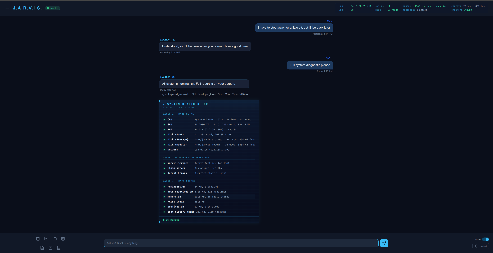
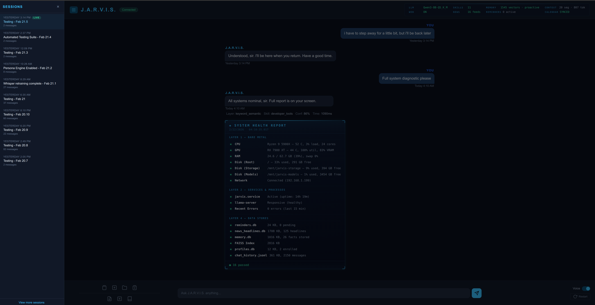
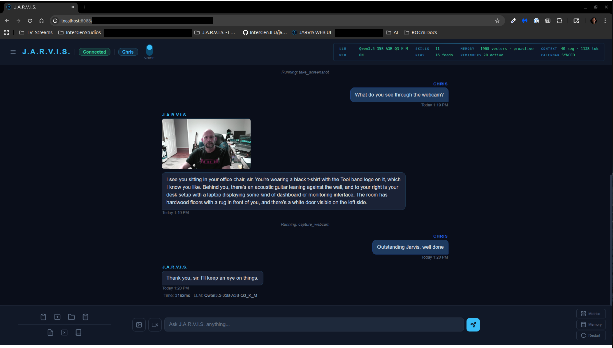
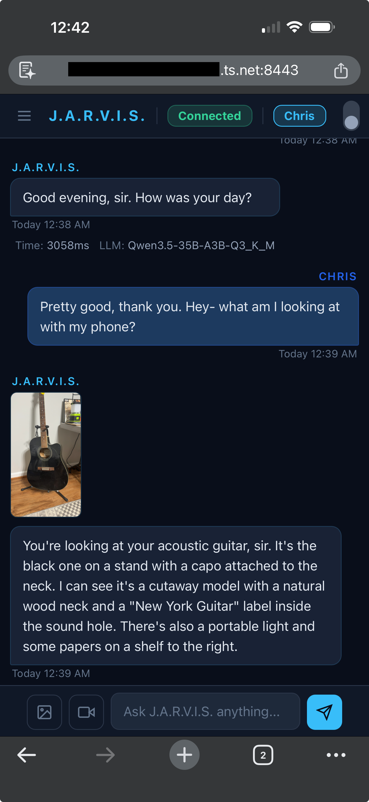

# JARVIS — Local Voice Assistant on AMD ROCm

A fully local, GPU-accelerated voice assistant with fine-tuned speech recognition, LLM-driven tool calling, computer vision, self-managing memory, and streaming TTS — all running on consumer AMD hardware. No cloud required for core operation.

**Built on:** Ubuntu 24.04 | Python 3.12 | ROCm 7.2 | AMD RX 7900 XT

---

## By the Numbers

| What | How Much |
|------|----------|
| **Codebase** | ~66,000 lines of Python across ~40 modules |
| **LLM** | Qwen3.5-35B-A3B (MoE, 3B active) — Q3_K_M on 20GB VRAM |
| **Tool calling accuracy** | 100% across 1,200+ trials (local LLM, no cloud) |
| **LLM tools** | 11 auto-discovered (one-file plugin system) |
| **Routing layers** | 18-layer shared priority chain, one router for 3 frontends |
| **Domain synthesis** | 17-domain classifier feeds 14 specialized anti-hallucination prompts |
| **Persona templates** | 38 response pools, ~184 templates, style-tagged ack cache |
| **Unit tests** | 314/314 passing (4 tiers) |
| **Conversation tests** | 62-conversation behavioral suite |
| **STT accuracy** | 94%+ (fine-tuned Whisper on Southern accent, 198 phrases) |
| **STT latency** | 0.1-0.2s (CTranslate2 on GPU) |
| **End-to-end** | 2-4s first spoken word (streaming LLM + streaming TTS) |
| **VRAM usage** | ~19.5 / 20 GB (RX 7900 XT, 32K context) |
| **Vision** | Desktop webcam + mobile camera relay + face enrollment |

---

## Demo

<video src="https://github.com/user-attachments/assets/857b4737-eef8-4bc5-8d71-d493a35c3934" width="100%" controls></video>

*3-minute demo: wake word activation, voice commands, web research, document generation, and desktop control — all running locally on AMD GPU.*

[](https://youtu.be/WsqLyUdl9ac)

*Watch on YouTube for full resolution with chapters.*

---

## Screenshots

### Web UI

*Browser-based chat with streaming responses, health check HUD, and system diagnostics*


*Session sidebar with conversation history, auto-detected sessions, and rename support*

### Vision — "What do you see through the webcam?"

*JARVIS describes the scene through the desktop webcam — identifying objects, clothing (including a favorite band shirt), furniture, and room layout. Qwen3.5 multimodal via mmproj, fully local.*

### Mobile Web UI + Vision

*Same vision capability from an iPhone over Tailscale VPN — webcam frame relayed via WebSocket, analyzed by the local LLM, response streamed back to mobile.*

### Console Mode

*Terminal interface with rich stats panel showing match layer, skill routing, confidence, and timing*

---

## Table of Contents

- [Demo](#demo)
- [Architecture](#architecture)
- [How Requests Flow](#how-requests-flow)
- [Key Subsystems](#key-subsystems)
- [Skills & Capabilities](#skills--capabilities)
- [Hardware Requirements](#hardware-requirements)
- [Installation](#installation)
- [Model Setup](#model-setup)
- [The Kokoro Voice](#the-kokoro-voice)
- [Usage](#usage)
- [Project Structure](#project-structure)
- [Configuration Reference](#configuration-reference)
- [Python & ROCm Pitfalls](#python--rocm-pitfalls)
- [Fine-Tuning Whisper](#fine-tuning-whisper)
- [Development](#development)
- [License](#license)

---

## Architecture

```
                        ┌──────────────────────┐
                        │   Porcupine Wake     │
                        │   Word Detection     │
                        └──────────┬───────────┘
                                   │ "Jarvis"
                        ┌──────────▼───────────┐
                        │  Ambient Filter      │
                        │  (position, copula,  │
                        │  threshold, length)  │
                        └──────────┬───────────┘
                                   │ verified wake word
                        ┌──────────▼───────────┐
                        │  Silero VAD v6 ONNX  │
                        │  Continuous Listener  │
                        │  (neural speech det) │
                        └──────────┬───────────┘
                                   │ audio frames
                        ┌──────────▼───────────┐
                        │  Speaker ID          │
                        │  (SpeechBrain        │
                        │  ECAPA-TDNN)         │
                        └──────────┬───────────┘
                                   │ user identity
                        ┌──────────▼───────────┐
                        │  Whisper STT v2      │
                        │  (CTranslate2/GPU)   │
                        │  198 phrases, 94%+   │
                        └──────────┬───────────┘
                                   │ text
                ┌──────────────────▼────────────────────┐
                │       ConversationRouter              │
                │  Shared 18-layer priority chain:      │
                │                                       │
                │  P0:     Delivery mode (read/display) │
                │  P1-2.8: Confirmations, dismissals,   │
                │          intros, reminders, acks      │
                │  P3:     Memory / recall / forget     │
                │  P3.1-3.7: Readback, artifacts, news  │
                │  Pre-P4: Task planner (compound       │
                │          detection, LLM plan gen)     │
                │  Pre-P4b: Self-hardware queries       │
                │                                       │
                │  ★ P4-LLM: Tool calling (11 tools)    │
                │    semantic pruner → Qwen3.5 decides  │
                │    domain classifier → 14 synthesis   │
                │    prompts (anti-hallucination)        │
                │                                       │
                │  P4: Skill routing (stateful skills)  │
                │  P5+: LLM fallback (Qwen → Claude)    │
                └──────┬──────────────┬─────────────────┘
                       │              │
            ┌──────────▼───┐   ┌──────▼──────────┐
            │  Skill       │   │  LLM Router     │
            │  Handler     │   │  Qwen → Claude  │
            │  (3 skills)  │   │  + 11 LLM Tools │
            └──────────┬───┘   └──────┬──────────┘
                       │              │
                ┌──────▼──────────────▼─────────┐
                │   Persona + Contextual Acks   │
                │   (38 pools, ~184 templates)  │
                └──────────────┬────────────────┘
                               │
                ┌──────────────▼────────────────┐
                │        Kokoro TTS             │
                │   StreamingAudioPipeline      │
                │   (gapless multi-sentence)    │
                └──────────────┬────────────────┘
                               │ PCM audio
                        ┌──────▼──────┐
                        │   aplay     │
                        │   (ALSA)    │
                        └─────────────┘
```

The system uses an **event-driven pipeline** with a Coordinator managing STT/TTS workers. The LLM response streams token-by-token, is chunked into sentences, and each sentence is synthesized and played as it arrives — the user hears the first sentence while the LLM is still generating the rest.

### Tools vs Skills

JARVIS has two extension mechanisms. The distinction matters:

| | **LLM Tools** | **Skills** |
|---|---|---|
| **What they are** | Stateless query->response functions the LLM calls | Stateful modules with multi-turn flows, confirmations, or desktop control |
| **Who decides** | Qwen3.5 selects which tool to call based on the user's query | Priority chain routes to the skill before the LLM sees the query |
| **How to add one** | Create one `.py` file in `core/tools/` — auto-discovered | Create a skill directory with `skill.py` + `metadata.yaml` |
| **Examples** | get_weather, find_files, developer_tools, recall_memory, take_screenshot | app_launcher (desktop verbs), file_editor (doc gen + confirmation), social_introductions (multi-turn) |
| **Count** | 11 tools (6 domain + 5 always-included) | 3 skill-only + 8 with companion tools |

Most functionality lives in **tools** now. Skills remain for things that need deterministic state machines, desktop integration, or nested LLM pipelines — things where "let the LLM decide" isn't reliable enough.

---

## How Requests Flow

Every request — voice, console, or web — hits the same `ConversationRouter.route()` method. The 18-layer priority chain evaluates top-to-bottom and returns on the first match:

1. **P0-P2.8** — Fast deterministic checks: delivery mode commands, rundown acceptance, task planner interrupts, reminder acks, memory forget confirms, introduction state machine, dismissal detection, bare ack filtering. Zero LLM involvement, sub-10ms.

2. **P3-P3.7** — Memory and artifact layers: recall/forget/transparency, structured readback (next/previous/section N), artifact reference resolution ("the second result", "that recipe"), news article pull-up.

3. **Pre-P4** — Compound request detection (22 regex signals like "and then", "after that") triggers the task planner, which generates a multi-step LLM plan and executes steps sequentially with per-step evaluation, pause/resume/cancel voice interrupts, and predictive timing announcements.

4. **P4-LLM** — The primary path. A semantic pruner scores all 11 tools against the query using sentence-transformer embeddings, selects the top 4, and hands them to Qwen3.5 with a dynamically-built system prompt. The LLM decides which tool to call (or none). After the tool returns data, a 17-domain classifier (math, medical, legal, sports, programming, etc.) selects one of 14 domain-specific synthesis prompts with tailored anti-hallucination constraints. The LLM then streams a natural language answer.

5. **P4-Skill** — Non-migrated stateful skills (app_launcher, file_editor, social_introductions) get their turn via 5-layer semantic intent matching.

6. **Fallback** — Pure LLM conversation: Qwen3.5 streams a response with quality gating. If gibberish, retries with a nudge. If still bad, falls back to Claude API.

---

## Key Subsystems

### Self-Managing Memory

MemGPT-pattern per-turn fact extraction: after every exchange, the LLM extracts durable facts and stores them in SQLite. The `recall_memory` tool (always available to the LLM) performs text + FAISS semantic search across stored facts. CMA 6/6 (Consolidation, Mapping, Abstraction) handles importance scoring, retrieval-driven mutation, associative linking between related facts, and episode-to-semantic knowledge promotion.

### Interaction Artifact Cache

5-phase typed cache system. Every tool result is stored as a typed artifact (weather, search, reminder, news, system, file, dev_tools, memory) in hot/warm/cold tiers. Phase 2 adds reference resolution — "the second result", "that recipe", "repeat that" all resolve to the correct cached artifact. Phase 3 adds sub-item navigation with on-demand LLM decomposition. Phase 4 promotes artifacts to long-term memory at session end. Phase 5 enables cross-session retrieval via FAISS semantic search across cold-tier artifacts.

### Vision Pipeline

Desktop webcam capture via ffmpeg MJPEG singleton (v4l2, 1280x720, 15fps, auto-start/stop with 30s idle shutdown). Mobile camera relay via WebSocket — the server sends a `frame_request`, the browser captures from `getUserMedia`, and returns a base64 JPEG `frame_response`. Both paths feed through PIL downscale and into the Qwen3.5 multimodal pipeline (mmproj-F16.gguf, CPU inference, 90s timeout). `take_screenshot` captures the desktop via gnome-screenshot with optional window cropping. `enroll_face` adds face recognition for presence-based greetings.

### Domain-Aware Response Synthesis

When the LLM calls a tool and gets results back, a 17-domain regex classifier categorizes the query (math, veterinary, medical, nutrition, finance, legal, gaming, sports, automotive, real estate, programming, science/tech, history, travel, factual, geo). This feeds into one of 14 domain-specific synthesis prompt blocks injected into `continue_after_tool_call()`. Each domain has tailored anti-hallucination constraints — medical responses disclaim, legal responses cite jurisdictions, programming responses specify versions. Domains without specialized prompts (math, factual, geo) use the generic synthesis template.

### Task Planner

22 conjunctive regex patterns detect compound requests ("check the weather and then create a packing list"). The LLM generates a JSON plan (max 4 steps), which executes sequentially with direct skill routing per step. Each step gets LLM evaluation (continue/adjust/stop). Voice interrupts (cancel, skip, pause, resume) work via an event queue checked between steps. Predictive timing announcements ("2 steps, about a few seconds") and error-aware planning (unreliable skill warnings) round it out.

### Persona Engine

38 response pool categories with ~184 templates, style-tagged contextual acknowledgments (10 pre-synthesized phrases: neutral, checking, working, research), dynamic honorific injection ("sir" for primary user, "ma'am"/"Ms. Guest" for secondary), domain-specific dry-humor disclaimers for hallucination-prone topics (medical, legal). Guest mode activates a security boundary with HAL 9000 easter egg greetings and restricted tool access (`get_weather` and `web_search` only).

### Additional Subsystems

| Subsystem | What It Does |
|-----------|-------------|
| **Conversation Router** | 18-layer shared priority chain for voice/console/web — one router, three frontends |
| **Tool Registry** | Auto-discovers `core/tools/*.py`, builds schemas, injects dependencies — adding a tool = one file |
| **MCP Bridge** | Bidirectional MCP: outbound server exposes JARVIS tools to external clients (Claude Code); inbound client consumes external MCP servers as native tools |
| **Self-Awareness** | Capability manifest + system state injected into LLM context — JARVIS knows what it can do, its current error rates, VRAM usage, and uptime |
| **Speaker ID** | SpeechBrain ECAPA-TDNN (192-dim, 0.80% EER) — identifies who's speaking and adjusts honorifics, tool access, and memory scope dynamically. Evolved from Resemblyzer d-vectors (256-dim, 5-8% EER) |
| **Face Recognition** | InsightFace ArcFace (512-dim, 99.83% LFW) — presence detection with proactive greetings, voice-driven face enrollment with pose instructions. Evolved from dlib/Haar cascade (128-dim, 97% LFW) |
| **Multi-Speaker Tracking** | Per-speaker history labels, rapid-switch detection (3 switches in 60s triggers a retort), participant-aware LLM context |
| **Context Window** | Topic-segmented working memory with relevance-scored assembly, 24K token budget, cross-session persistence |
| **Streaming TTS** | `StreamingAudioPipeline` — single persistent aplay process, background Kokoro generation, gapless playback |
| **TTS Normalizer** | 22-pass text normalization: markdown, heteronyms, IPs, ports, CPU/GPU names, model nomenclature, quant strings, years, file sizes, timestamps, currencies, fractions, measurements, temperatures, URLs, paths, and more |
| **Structured Readback** | LLM-parsed section navigation with voice control (next/previous/section N) + delivery modes (read/display/print/browse) |
| **People Manager** | SQLite contacts database with relationship tracking, TTS pronunciation overrides, LLM context injection for known people |
| **Web Research** | Serper (primary) + DuckDuckGo (fallback) + trafilatura, 5min TTL cache, parallel page fetching, multi-source synthesis |
| **Google Calendar** | Two-way sync with dedicated JARVIS calendar, OAuth, incremental sync, background polling, multi-notification composite keys |
| **Health Check** | 5-layer system diagnostic (bare metal, services, internals, data stores, self-assessment) with ANSI terminal report + voice summary |
| **GNOME Desktop Bridge** | Custom GNOME Shell extension providing Wayland-native window management via D-Bus, with wmctrl fallback for XWayland |
| **Ambient Filter** | Multi-signal wake word validation: position, copula, threshold (0.80), length — blocks ambient mentions like "I was just telling Jarvis about..." |

---

## Skills & Capabilities

### LLM Tools (Qwen3.5 decides when to call)

Stateless query->response functions. The LLM receives the user's query, selects the right tool, calls it, and synthesizes a natural language answer from the result.

| Tool | Examples | What It Does |
|------|---------|-------------|
| **get_weather** | "What's the weather?" / "Will it rain?" | OpenWeatherMap API — current conditions, forecast, rain check |
| **get_system_info** | "What CPU do I have?" / "How much RAM?" | 8 sub-handlers: cpu, memory, disk, gpu, network, processes, uptime, all |
| **find_files** | "Find my config file" / "Show recent files" | 11 actions: search, count, list, dir sizes, disk usage, file info, tree, large files, package info |
| **developer_tools** | "Git status" / "Search codebase for TODO" | 13 actions: codebase search, git multi-repo, system admin, general shell, visual output, 3-tier safety |
| **manage_reminders** | "Remind me at 3pm" / "What's on my schedule?" | 5 actions: add, list, cancel, acknowledge, snooze. Priority tones, nag behavior |
| **get_news** | "Read me the headlines" / "Cybersecurity news?" | 16 RSS feeds, urgency classification, semantic dedup, category/priority filtering |
| **web_search** | "Who won the Super Bowl?" | Serper primary + DDG fallback, trafilatura multi-source synthesis (always available) |
| **recall_memory** | "What's my favorite color?" | SQLite text + FAISS semantic search across stored facts (always available) |
| **take_screenshot** | "What's on my screen?" | gnome-screenshot + optional window crop, LANCZOS downscale, base64 to LLM vision |
| **capture_webcam** | "What do you see?" / "What am I holding?" | Desktop webcam or mobile camera relay, PIL downscale, base64 to Qwen3.5 mmproj |
| **enroll_face** | "Learn my face" / "Remember what I look like" | Face detection + embedding storage for presence-based greetings |

### Skills (Deterministic routing — state machines and desktop control)

These handle things that need multi-turn flows, confirmations, or direct desktop integration.

| Skill | Examples | How It Works |
|-------|---------|-------------|
| **File Editor** | "Write a script that..." / "Create a presentation about..." | 5 intents: write, edit, read, delete + list. Two-stage LLM content generation. Document generation: PPTX/DOCX/PDF with web research integration and Pexels stock images. Confirmation flow for destructive ops |
| **Desktop Control** | "Open Chrome" / "Volume up" / "Switch to workspace 2" | 16 intents: app launch/close, window management, volume, workspaces, focus, clipboard via GNOME Shell extension D-Bus bridge |
| **Social Introductions** | "Meet my niece Arya" / "Who is Arya?" | Multi-turn butler-style introduction flow: name confirmation, pronunciation check, fact gathering, persistent people database with TTS pronunciation overrides |

**Conversation** (greetings, small talk, "how are you?") is handled directly by the LLM — no dedicated skill needed.

### Document Generation

JARVIS generates PPTX, DOCX, and PDF documents through a two-stage LLM pipeline. Stage 1 gathers content (optionally via web research). Stage 2 structures it into the target format. Presentations pull stock images from the Pexels API. Generated documents land in a shared folder and can be opened on the desktop via "open it" or read back via "read it to me" with structured section navigation.

---

## Hardware Requirements

### Minimum

| Component | Requirement |
|-----------|------------|
| CPU | x86_64, 4+ cores |
| RAM | 8GB |
| Storage | 10GB free |
| Audio | USB microphone + speakers |
| OS | Ubuntu 24.04 LTS |

### Recommended (What This Was Built On)

| Component | Spec |
|-----------|------|
| CPU | AMD Ryzen 9 5900X (24 threads) |
| GPU (compute) | AMD RX 7900 XT (20GB VRAM) — STT + LLM |
| GPU (display) | AMD RX 7600 — compositor only |
| RAM | 64GB |
| Microphone | USB condenser mic (FIFINE K669B tested) |
| OS | Ubuntu 24.04 LTS |
| ROCm | 7.2.0 |

> **GPU acceleration is optional but transformative.** CPU-only Whisper takes 0.3-0.5s per transcription. With GPU: 0.1-0.2s. The local LLM (Qwen3.5-35B-A3B) runs via llama.cpp with full GPU offload at ~48-63 tok/s. Dual GPU setup dedicates the RX 7900 XT entirely to compute while the RX 7600 handles the desktop compositor.

---

## Installation

### 1. Clone the Repository

```bash
git clone https://github.com/YOUR_USER/jarvis.git ~/jarvis
cd ~/jarvis
```

### 2. Install System Dependencies

```bash
sudo apt update
sudo apt install -y \
    portaudio19-dev python3-pyaudio \
    build-essential cmake \
    alsa-utils \
    ffmpeg
```

### 3. Install Python Dependencies

JARVIS uses **system Python 3.12** — not a virtualenv. See [Python & ROCm Pitfalls](#python--rocm-pitfalls) for why.

```bash
pip install --break-system-packages -r requirements.txt

# Additional packages not in requirements.txt
pip install --break-system-packages \
    faster-whisper \
    sentence-transformers \
    speechbrain \
    insightface \
    silero-vad \
    kokoro \
    soundfile \
    trafilatura \
    duckduckgo-search \
    faiss-cpu
```

### 4. Install llama.cpp (for local LLM)

```bash
cd ~
git clone https://github.com/ggml-org/llama.cpp
cd llama.cpp
mkdir build && cd build

# CPU-only build:
cmake .. -DCMAKE_BUILD_TYPE=Release
# OR with ROCm GPU:
cmake .. -DCMAKE_BUILD_TYPE=Release -DGGML_HIP=ON -DCMAKE_HIP_ARCHITECTURES=gfx1100

make -j$(nproc)
```

### 5. Install Piper TTS (fallback)

```bash
pip install --break-system-packages piper-tts
```

### 6. Configure API Keys

```bash
cp .env.example ~/jarvis/.env
nano ~/jarvis/.env
```

Fill in your keys:
- **PORCUPINE_ACCESS_KEY** — Free tier at [picovoice.ai](https://picovoice.ai/)
- **ANTHROPIC_API_KEY** — From [console.anthropic.com](https://console.anthropic.com/) (LLM fallback)
- **OPENWEATHER_API_KEY** — Free tier at [openweathermap.org](https://openweathermap.org/api) (weather skill)
- **PEXELS_API_KEY** — Free tier at [pexels.com/api](https://www.pexels.com/api/) (stock images for document generation — optional, text-only slides without it)

### 7. Download Models

See [Model Setup](#model-setup) below for detailed instructions with download links.

### 8. Configure

Edit `config.yaml` and update paths to match your model locations. See [Configuration Reference](#configuration-reference).

### 9. Set Up Systemd Service

```bash
mkdir -p ~/.config/systemd/user
cp jarvis.service ~/.config/systemd/user/

# If using a local LLM:
cp llama-server.service ~/.config/systemd/user/

# Enable linger (service runs without active login)
loginctl enable-linger $USER

# Enable and start
systemctl --user daemon-reload
systemctl --user enable jarvis
systemctl --user start jarvis

# Check status
systemctl --user status jarvis
journalctl --user -u jarvis -f
```

### 10. Test

Say: **"Jarvis, what time is it?"**

Or use console mode (no microphone needed):
```bash
python3 jarvis_console.py
```

---

## Model Setup

JARVIS uses several AI models. Here's where to get each one.

### Whisper STT (Speech-to-Text)

| Model | Source | Format | Purpose |
|-------|--------|--------|---------|
| **whisper-base** | [ggerganov/whisper.cpp](https://huggingface.co/ggerganov/whisper.cpp/resolve/main/ggml-base.bin) | GGML | CPU fallback |
| **faster-whisper base** | Auto-downloaded by `faster-whisper` | CTranslate2 | GPU-accelerated (recommended) |

```bash
# CPU fallback model (optional)
mkdir -p /path/to/models/whisper
wget -O /path/to/models/whisper/ggml-base.bin \
    https://huggingface.co/ggerganov/whisper.cpp/resolve/main/ggml-base.bin
```

The GPU model is auto-downloaded by `faster-whisper` on first run. You can also [fine-tune Whisper](#fine-tuning-whisper) on your accent.

### Qwen3.5-35B-A3B LLM

| Model | Source | Format | Quantization |
|-------|--------|--------|-------------|
| **Qwen3.5-35B-A3B** | [unsloth GGUF](https://huggingface.co/unsloth/Qwen3.5-35B-A3B-GGUF) | GGUF | Q3_K_M recommended (imatrix-calibrated) |

```bash
mkdir -p /path/to/models/llm
# Download pre-quantized Q3_K_M (~16GB) from unsloth (trusted, imatrix-calibrated):
huggingface-cli download unsloth/Qwen3.5-35B-A3B-GGUF \
    Qwen3.5-35B-A3B-Q3_K_M.gguf --local-dir /path/to/models/llm
```

The LLM runs via llama.cpp as a server process. The systemd service `llama-server.service` manages it. Qwen3.5-35B-A3B is a MoE model (256 experts, 8+1 active, ~3B active params) with native tool calling. At Q3_K_M quantization, it fits in ~19.5GB VRAM with 32K context, leaving headroom on a 20GB card. IFEval 91.9, SWE-bench 69.2.

### Kokoro TTS (Primary Voice)

| Model | Source | Size | Runtime |
|-------|--------|------|---------|
| **Kokoro-82M** | [hexgrad/Kokoro-82M](https://huggingface.co/hexgrad/Kokoro-82M) | 82M params | CPU (in-process) |

Kokoro auto-downloads from HuggingFace Hub on first initialization. No manual download needed.

See [The Kokoro Voice](#the-kokoro-voice) for how the custom voice blend works.

### Piper TTS (Fallback)

| Model | Source | Format |
|-------|--------|--------|
| **en_GB-northern_english_male-medium** | [rhasspy/piper-voices](https://huggingface.co/rhasspy/piper-voices/tree/main/en/en_GB/northern_english_male/medium) | ONNX |

```bash
mkdir -p /path/to/models/piper
cd /path/to/models/piper

wget https://huggingface.co/rhasspy/piper-voices/resolve/main/en/en_GB/northern_english_male/medium/en_GB-northern_english_male-medium.onnx
wget https://huggingface.co/rhasspy/piper-voices/resolve/main/en/en_GB/northern_english_male/medium/en_GB-northern_english_male-medium.onnx.json
```

### Sentence Transformers (Semantic Matching)

| Model | Source | Purpose |
|-------|--------|---------|
| **nomic-embed-text-v1.5** | [nomic-ai](https://huggingface.co/nomic-ai/nomic-embed-text-v1.5) | Intent matching, memory search, tool pruning, news dedup (768-dim, GPU) |

Runs on RX 7600 GPU (~9ms/query). Evolved from all-MiniLM-L6-v2 (384-dim, CPU, ~1ms but lower quality). +6 MTEB points, 8192 token context (vs 256).

### Porcupine (Wake Word)

| Component | Source | Note |
|-----------|--------|------|
| **pvporcupine** | [picovoice.ai](https://picovoice.ai/) | Requires free API key |

Get a free access key from Picovoice and add it to your `.env` file.

### SpeechBrain (Speaker ID)

| Model | Source | Purpose |
|-------|--------|---------|
| **ECAPA-TDNN** | [speechbrain/spkrec-ecapa-voxceleb](https://huggingface.co/speechbrain/spkrec-ecapa-voxceleb) | Speaker identification (192-dim, 0.80% EER) |

Runs on RX 7600 GPU. Evolved from Resemblyzer VoiceEncoder (256-dim, 5-8% EER) — 10x accuracy improvement. RMS-normalized pipeline with scipy bandlimited resampling for consistent scores across volume levels. Sticky identity cached for 60s to avoid re-verification during conversation.

### InsightFace (Face Recognition)

| Model | Source | Purpose |
|-------|--------|---------|
| **buffalo_l (RetinaFace + ArcFace)** | [insightface](https://github.com/deepinsight/insightface) | Face detection + 512-dim recognition (99.83% LFW) |

Single-pass detection and identification, replacing the previous two-tier Haar cascade + dlib system (128-dim, 97% LFW). Powers presence detection (proactive greetings) and voice-driven face enrollment with guided pose instructions.

### Silero VAD (Voice Activity Detection)

| Model | Source | Purpose |
|-------|--------|---------|
| **Silero VAD v6.2.1** | [silero-vad](https://github.com/snakers4/silero-vad) | Neural speech/noise discrimination (ONNX, stateful) |

Replaced WebRTC VAD. Neural network with cross-chunk context for better barge-in detection, speech/noise distinction, and music rejection. 16% fewer errors on noisy data. 0.14ms/chunk on CPU.

---

## The Kokoro Voice

JARVIS uses [Kokoro-82M](https://huggingface.co/hexgrad/Kokoro-82M), a lightweight 82-million parameter TTS model that runs on CPU. What makes it special is the **voice blending** system.

### How Voice Blending Works

Kokoro ships with multiple voice presets as PyTorch tensors (`.pt` files). JARVIS loads two voices and blends them via linear interpolation:

```python
# From core/tts.py — the voice blend
voice_a = torch.load("bm_fable.pt")    # British male, warm
voice_b = torch.load("bm_george.pt")   # British male, deeper
blended = voice_a * 0.5 + voice_b * 0.5  # 50/50 blend
```

This creates a voice that has the warmth of "fable" with the depth of "george" — more natural than either voice alone.

### Configuration

```yaml
# config.yaml
tts:
  engine: kokoro
  kokoro_voice_a: bm_fable        # First voice
  kokoro_voice_b: bm_george       # Second voice
  kokoro_blend_ratio: 0.5         # 0.0 = all george, 1.0 = all fable
  kokoro_speed: 1.0               # Playback speed
```

### Available Voices

Kokoro includes several voice presets. The `bm_` prefix means "British male":
- `bm_fable` — warm, narrator-like
- `bm_george` — deeper, more authoritative
- `bf_emma` — British female
- `am_adam` — American male
- And more — check the [Kokoro model card](https://huggingface.co/hexgrad/Kokoro-82M) for the full list.

### Why Kokoro Over Other TTS?

We evaluated several TTS engines:

| Engine | Verdict | Notes |
|--------|---------|-------|
| **Kokoro 82M** | Primary | Best quality-to-speed ratio. CPU-only avoids GPU contention with STT/LLM. 82M params loads in <2s. |
| **Piper** | Fallback | Good but more robotic. ONNX format, subprocess-based. Used when Kokoro fails to initialize. |
| **StyleTTS 2** | Rejected | Superior quality but 10x slower, required GPU (competing with STT), and PyTorch dependency conflicts. |

### Streaming Playback

JARVIS doesn't wait for the full response before speaking. The `StreamingAudioPipeline` synthesizes each sentence in the background while the previous one plays, maintaining a single persistent `aplay` process for gapless audio.

---

## Usage

### Voice Mode (Production)

```bash
# Start via systemd
systemctl --user start jarvis

# Check status
systemctl --user status jarvis

# Live logs
journalctl --user -u jarvis -f
```

Say the wake word ("Jarvis") followed by your command:
- *"Jarvis, what time is it?"*
- *"Jarvis, what's the weather like?"*
- *"Jarvis, remind me to check the oven in 20 minutes"*
- *"Jarvis, search the codebase for TODO"*
- *"Jarvis, who won the Super Bowl?"*
- *"Jarvis, read me the tech headlines"*
- *"Jarvis, create a presentation about renewable energy"*
- *"Jarvis, open Chrome"*
- *"Jarvis, what's on my screen?"*
- *"Jarvis, check the weather and then create a packing list document"*

After JARVIS responds, you have a **conversation window** (4-7 seconds, adaptive) to ask follow-up questions without repeating the wake word. The window extends with conversation depth and when JARVIS asks a question.

### Console Mode

```bash
# Text-only mode — type commands, see responses + stats panel
python3 jarvis_console.py

# Hybrid mode — type commands, responses printed AND spoken
python3 jarvis_console.py --hybrid

# Speech mode — full voice pipeline via terminal
python3 jarvis_console.py --speech
```

The console displays a stats panel after each command showing match layer, skill, confidence score, timing, and LLM token counts.

### Web UI

```bash
# Start the web interface
python3 jarvis_web.py

# Then open http://127.0.0.1:8088 in your browser
# HTTPS available at https://0.0.0.0:8443 (Tailscale certs)
```

The web UI provides the same full pipeline with streaming LLM responses, markdown rendering, drag/drop file handling, web research, image upload + webcam/mobile camera for vision queries, conversation history with session sidebar, health check HUD, memory dashboard at `/memory`, and LLM metrics at `/metrics`.

---

## Project Structure

```
jarvis/                              # ~66,000 lines of Python
├── jarvis_continuous.py             # Voice mode entry point (~994 lines)
├── jarvis_console.py                # Console entry point (~1,495 lines)
├── jarvis_web.py                    # Web UI entry point (~3,875 lines)
├── config.yaml                      # Main configuration
├── .env                             # API keys (not in repo)
│
├── core/                            # Core modules (~32,700 lines)
│   ├── conversation_router.py       # 18-layer shared priority chain (~3,003 lines)
│   ├── llm_router.py                # LLM routing, tool calling, domain synthesis (~1,814 lines)
│   ├── interaction_cache.py         # 5-phase artifact cache (~1,993 lines)
│   ├── pipeline.py                  # Event-driven Coordinator + workers (~2,054 lines)
│   ├── task_planner.py              # Compound detection + LLM plan execution (~1,097 lines)
│   ├── tts_normalizer.py            # 22-pass text normalization (~1,072 lines)
│   ├── skill_manager.py             # 5-layer intent matching (~931 lines)
│   ├── health_check.py              # 5-layer system diagnostic (~908 lines)
│   ├── continuous_listener.py       # VAD + wake word + ambient filter (~885 lines)
│   ├── tts.py                       # Kokoro + Piper, streaming pipeline (~722 lines)
│   ├── persona.py                   # 38 response pools, system prompts (~726 lines)
│   ├── memory_manager.py            # SQLite facts + FAISS + CMA 6/6
│   ├── context_window.py            # Topic-segmented working memory
│   ├── self_awareness.py            # Capability manifest + system state
│   ├── conversation.py              # History, cross-session, multi-speaker
│   ├── reminder_manager.py          # Reminders, rundowns, calendar sync
│   ├── desktop_manager.py           # GNOME D-Bus + wmctrl + volume
│   ├── people_manager.py            # People DB, TTS pronunciation
│   ├── webcam_manager.py            # ffmpeg MJPEG + mobile camera relay
│   ├── speaker_id.py                # SpeechBrain ECAPA-TDNN speaker ID
│   ├── presence_detector.py         # InsightFace face detection + greetings
│   ├── stt.py                       # faster-whisper CTranslate2/GPU
│   ├── tool_registry.py             # Auto-discovery, schema assembly
│   ├── awareness.py                 # Unified context assembly
│   ├── mcp_client.py / mcp_server.py  # Bidirectional MCP bridge
│   └── tools/                       # 11 one-file tool definitions
│       ├── get_weather.py
│       ├── get_system_info.py
│       ├── find_files.py
│       ├── developer_tools.py
│       ├── manage_reminders.py
│       ├── get_news.py
│       ├── web_search.py
│       ├── recall_memory.py
│       ├── take_screenshot.py
│       ├── capture_webcam.py
│       └── enroll_face.py
│
├── skills/                          # Skill implementations
│   ├── system/
│   │   ├── time_info/               # Instant time/date (semantic matching)
│   │   ├── weather/                 # Companion to get_weather tool
│   │   ├── system_info/             # Companion to get_system_info tool
│   │   ├── filesystem/              # Companion to find_files tool
│   │   ├── file_editor/             # Doc gen (PPTX/DOCX/PDF) + file CRUD
│   │   ├── developer_tools/         # Companion to developer_tools tool
│   │   ├── app_launcher/            # 16-intent desktop control
│   │   └── web_navigation/          # Playwright web browsing
│   └── personal/
│       ├── reminders/               # Voice reminders + Google Calendar
│       ├── news/                    # 16-feed RSS delivery
│       └── social_introductions/    # Multi-turn butler-style introductions
│
├── web/                             # Web UI frontend (~1,927 lines JS)
│   ├── index.html
│   ├── style.css
│   └── app.js                       # WebSocket client, webcam, file browser
├── extensions/
│   └── jarvis-desktop@jarvis/       # GNOME Shell extension (D-Bus bridge)
├── scripts/                         # Test suites + utilities
│   ├── unit_tests.sh                # 314 tests across 4 tiers
│   ├── test_conversations.py        # 62-conversation behavioral suite
│   ├── test_tool_calling.py         # 175+ queries, 10-category taxonomy
│   ├── test_tool_artifacts.py       # 175 artifact wiring tests
│   ├── test_vision.py               # 180 vision pipeline tests
│   ├── test_web_handler.py          # 61 web handler tests
│   ├── test_manage_memory.py        # 43 memory tests
│   └── ...
└── docs/
    ├── SKILL_DEVELOPMENT.md         # How to create tools and skills
    ├── VOICE_TRAINING_GUIDE.md      # Whisper fine-tuning
    └── ...
```

---

## Configuration Reference

The main configuration lives in `config.yaml`. Here are the key sections:

### Audio

```yaml
audio:
  mic_device: "USB PnP Audio Device"   # Your microphone name
  sample_rate: 16000                    # Don't change (Whisper expects 16kHz)
  channels: 1
  output_device: default                # PipeWire default (or plughw:0,0 for direct ALSA)
  device_monitor_interval: 5.0         # Hot-plug detection interval
```

### LLM

```yaml
llm:
  local:
    model_path: /path/to/models/llm/Qwen3.5-35B-A3B-Q3_K_M.gguf
    context_size: 32768
    gpu_layers: 999          # Offload all layers to GPU
    temperature: 0.6
    tool_calling: true       # Enable LLM tool calling (11 tools)
  api:
    provider: anthropic      # Fallback LLM
    model: claude-sonnet-4-20250514
    api_key_env: ANTHROPIC_API_KEY
```

### TTS

```yaml
tts:
  engine: kokoro                      # 'kokoro' or 'piper'
  kokoro_voice_a: bm_fable
  kokoro_voice_b: bm_george
  kokoro_blend_ratio: 0.5             # Voice blend
  kokoro_speed: 1.0
  # Piper fallback
  model_path: /path/to/models/piper/en_GB-northern_english_male-medium.onnx
  config_path: /path/to/models/piper/en_GB-northern_english_male-medium.onnx.json
```

### Semantic Matching

```yaml
semantic_matching:
  enabled: true
  model: nomic-ai/nomic-embed-text-v1.5
  cache_dir: /path/to/models/sentence-transformers
  default_threshold: 0.85    # Minimum confidence for intent match
  fallback_to_llm: true      # Send unmatched queries to LLM
```

For the full configuration reference, see the comments in `config.yaml`.

---

## Python & ROCm Pitfalls

Building JARVIS on an AMD GPU with ROCm taught some hard lessons. Here's what to watch out for.

### Use System Python, Not Virtualenvs

JARVIS runs on **system Python 3.12** with `--break-system-packages`. This sounds wrong, but:

- **ROCm libraries** (`/opt/rocm-7.2.0/lib/`) must be on the system `LD_LIBRARY_PATH`
- **CTranslate2** is built from source against ROCm — it links to system-level `.so` files
- **PyTorch ROCm** (`torch+rocm7.1`) also needs the same ROCm libraries
- Virtualenvs create isolation that **breaks these shared library dependencies**

We tested a CUDA-targeted venv. It was 9.3GB and completely non-functional on AMD hardware. Lesson learned.

### CTranslate2 Must Be Built from Source for ROCm

The pip version of CTranslate2 is CUDA-only. For AMD GPUs:

```bash
git clone --recursive https://github.com/OpenNMT/CTranslate2.git
cd CTranslate2 && mkdir build && cd build

cmake .. \
  -DWITH_HIP=ON \
  -DWITH_MKL=OFF \
  -DWITH_OPENBLAS=ON \
  -DCMAKE_HIP_ARCHITECTURES=gfx1100 \
  -DCMAKE_BUILD_TYPE=Release \
  -DCMAKE_HIP_COMPILER=/opt/rocm/lib/llvm/bin/clang++ \
  -DCMAKE_CXX_COMPILER=/opt/rocm/lib/llvm/bin/clang++ \
  -DCMAKE_C_COMPILER=/opt/rocm/lib/llvm/bin/clang \
  -DCMAKE_PREFIX_PATH=/opt/rocm \
  -DBUILD_CLI=OFF

make -j$(nproc)
sudo make install && sudo ldconfig

# Python bindings
cd ../python
pip install --break-system-packages .
```

Find your GPU architecture with `rocminfo | grep gfx`.

### PyTorch + CTranslate2 Coexistence

Both PyTorch (`torch 2.10.0+rocm7.1`) and CTranslate2 use `/opt/rocm-7.2.0/lib/`. They coexist fine **if**:

1. Both are installed at the system level (not in separate venvs)
2. `LD_LIBRARY_PATH` includes `/opt/rocm-7.2.0/lib/`
3. The ROCm environment variables are set:

```bash
export HSA_OVERRIDE_GFX_VERSION=11.0.0
export ROCM_PATH=/opt/rocm-7.2.0
export LD_LIBRARY_PATH=/opt/rocm-7.2.0/lib
```

### Environment Variables for ROCm

These must be set for both the systemd service and any manual runs:

| Variable | Value | Purpose |
|----------|-------|---------|
| `HSA_OVERRIDE_GFX_VERSION` | `11.0.0` | GPU architecture override for RDNA 3 |
| `ROCM_PATH` | `/opt/rocm-7.2.0` | ROCm installation path |
| `LD_LIBRARY_PATH` | `/opt/rocm-7.2.0/lib` | Shared library search path |

### Import Order Matters (Historical)

Early in development, the order of `import torch` vs `import ctranslate2` determined which ROCm version was loaded. This is resolved now, but as a defensive practice, `core/stt.py` avoids importing torch directly.

---

## Fine-Tuning Whisper

JARVIS supports fine-tuning Whisper on your voice and accent. This is what transforms it from a generic model into one that understands *you*.

### Why Fine-Tune?

The base Whisper model struggles with:
- Regional accents (Southern US, British dialects, etc.)
- Domain-specific vocabulary (technical terms, project names)
- Proper nouns it hasn't seen

### Process

1. **Record training data** — 198 utterances covering problem words, domain vocabulary, and natural speech patterns
2. **Train** — Fine-tune from the base Whisper model using HuggingFace Transformers (89 seconds on RX 7900 XT, fp16)
3. **Convert** — Export to CTranslate2 format for GPU-accelerated inference
4. **Deploy** — Update `config.yaml` to point to the new model

See [docs/VOICE_TRAINING_GUIDE.md](docs/VOICE_TRAINING_GUIDE.md) for the complete process.

### Results (v2 — FIFINE K669B, 198 phrases)

| Metric | Before | After |
|--------|--------|-------|
| General accuracy | ~80% | 94%+ |
| Domain vocabulary | ~60% | ~95%+ |
| Wake word detection | ~90% | 100% |
| Contraction handling | ~70% | 100% |
| Latency (GPU) | 0.1-0.2s | 0.1-0.2s (unchanged) |

---

## Development

### Adding New Functionality

There are two paths depending on what you're building. See [docs/SKILL_DEVELOPMENT.md](docs/SKILL_DEVELOPMENT.md) for the full guide with examples.

**Path 1: LLM Tool** (stateless data query — most new features)

Create one `.py` file in `core/tools/`. The registry auto-discovers it.

```python
# core/tools/your_tool.py
TOOL_NAME = "your_tool"
SKILL_NAME = "your_skill"       # or None if not skill-gated
SCHEMA = { ... }                 # OpenAI function schema
SYSTEM_PROMPT_RULE = "..."       # When to use this tool
def handler(args):               # Execute and return result string
    return "result"
```

That's it — no wiring changes, no imports to update, no registry edits. The tool registry auto-discovers `.py` files in `core/tools/`, builds the OpenAI-compatible schema, injects runtime dependencies, and makes it available to the LLM.

**Path 2: Skill** (stateful, multi-turn, desktop control, or nested LLM flows)

```
skills/system/your_skill/
├── skill.py           # Main logic (extends BaseSkill)
├── metadata.yaml      # Skill config + semantic intents
└── __init__.py        # Exports
```

Skills register semantic intents (natural language examples) and the sentence-transformer model matches user speech against them.

### Test Suites

| Suite | Tests | What It Validates |
|-------|-------|-------------------|
| **Unit tests** (`unit_tests.sh`) | 314 | 4 tiers: edge cases, routing, tool calling, LLM quality |
| **Conversation tests** (`test_conversations.py`) | 62 conversations, 270+ turns | End-to-end behavioral validation via WebSocket |
| **Tool artifact tests** (`test_tool_artifacts.py`) | 175 | Tool result -> artifact cache wiring |
| **Vision tests** (`test_vision.py`) | 180 | Frame parsing, webcam lifecycle, screenshot, mobile relay, presence |
| **Web handler tests** (`test_web_handler.py`) | 61 | WebSocket dispatch, mobile routing, client detection |
| **Memory tests** (`test_manage_memory.py`) | 43 | Fact extraction, recall, registry integration |

### Architecture Principles

1. **Privacy first** — Everything runs locally. Claude API is a quality fallback, not a dependency.
2. **LLM-centric** — Qwen3.5 decides which tools to call. Skills exist for things that need deterministic state machines.
3. **Streaming everything** — LLM tokens stream to TTS, TTS streams to audio. No waiting for full responses.
4. **Graceful degradation** — GPU fails? Fall back to CPU. Kokoro fails? Fall back to Piper. Local LLM fails? Fall back to Claude API. Webcam fails? Fall back to mobile camera.
5. **One router, three frontends** — Voice, console, and web all hit the same 18-layer priority chain. No routing duplication.
6. **One-file extensibility** — Adding a tool is one Python file. Adding a skill is one directory. No wiring changes anywhere.

---

## Acknowledgments

### Models & Libraries

- [Kokoro-82M](https://huggingface.co/hexgrad/Kokoro-82M) by hexgrad — TTS model
- [faster-whisper](https://github.com/SYSTRAN/faster-whisper) by SYSTRAN — GPU-accelerated Whisper
- [CTranslate2](https://github.com/OpenNMT/CTranslate2) by OpenNMT — Inference engine
- [llama.cpp](https://github.com/ggml-org/llama.cpp) by ggml-org — LLM inference
- [Qwen3.5-35B-A3B](https://huggingface.co/Qwen/Qwen3.5-35B-A3B) by Qwen — Local LLM (MoE, native tool calling)
- [Piper](https://github.com/rhasspy/piper) by rhasspy — Fallback TTS
- [sentence-transformers](https://github.com/UKPLab/sentence-transformers) — Semantic matching
- [Porcupine](https://picovoice.ai/) by Picovoice — Wake word detection
- [Resemblyzer](https://github.com/resemble-ai/Resemblyzer) by Resemble AI — Speaker identification
- [Playwright](https://playwright.dev/) — Web navigation

---

## License

MIT License — see [LICENSE](LICENSE) for details.

---

**Version:** 5.0.0
**Status:** Production — actively developed
**Last Updated:** March 11, 2026
